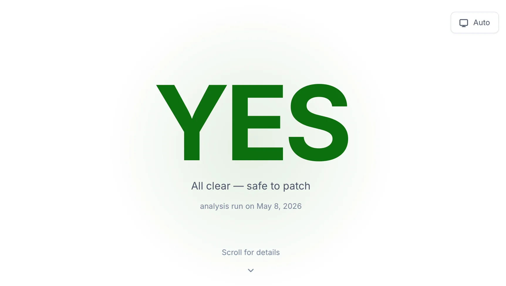

# is-windows-broken

[](https://api.is-windows-broken.com/api/v1/patch-status)
[](https://is-windows-broken.com)

Patch Tuesday readiness for Windows Server and Windows 11. `is-windows-broken` tracks Microsoft release-health data and publishes a cached go/no-go view for deciding whether it is safe to patch.



## Website

- Website: [https://is-windows-broken.com](https://is-windows-broken.com)
- API: [https://api.is-windows-broken.com/api/v1/patch-status](https://api.is-windows-broken.com/api/v1/patch-status)

## What It Does

The site displays the newest cached patch assessment for tracked Windows releases:

- overall patch status
- short operational summary
- confidence score
- per-version Windows status
- analysis run date
- Microsoft source-page date

The public API returns the latest 10 cached runs. The frontend renders the newest entry.

Tracked releases currently include Windows Server 2022, Windows Server 2025, and major Windows 11 release-health pages.

## Public API

```text
GET https://api.is-windows-broken.com/api/v1/patch-status
```

Example:

```bash
curl -s https://api.is-windows-broken.com/api/v1/patch-status | jq
```

Response shape:

```json
{
  "ok": true,
  "count": 4,
  "items": [
    {
      "generatedAt": "2026-05-08T08:04:30.018Z",
      "patch": {
        "berlinDate": "2026-05-08",
        "patchTuesday": "2026-05-12",
        "patchDay": "2026-05-20",
        "activeWindow": false
      },
      "overall": {
        "status": "GREEN",
        "should_block_patch": false,
        "summary": "No active blocker issues detected.",
        "confidence": 0.97
      },
      "versions": [
        {
          "version": "Windows Server 2022",
          "status": "GREEN",
          "should_block_patch": false,
          "summary": "No active known issues.",
          "data_date": "2026-05-08"
        }
      ]
    }
  ]
}
```

## How It Works

The backend periodically fetches Microsoft Windows release-health pages and supplemental Windows admin news, summarizes the evidence through an asynchronous Batch API workflow, and stores the result as a small cached JSON history.

The public website never calls the model directly. It only reads the cached API response, which keeps the page fast, stable, and cheap to serve.

## Local Development

```bash
cd app
npm ci
npm run dev
```

To test a production build locally:

```bash
cd app
npm run build
npm run preview
```

## Notes

- This repo contains the public frontend only.
- The API intentionally exposes a scrubbed public response, not internal batch or model metadata.
